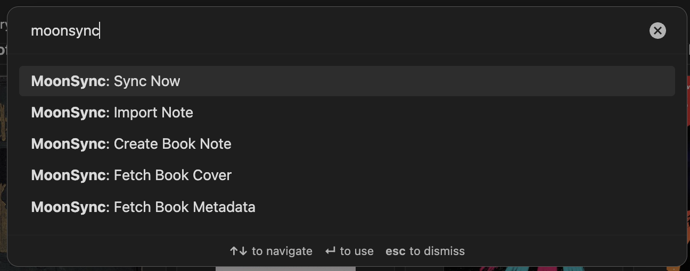

# MoonSync

Sync your reading highlights, notes, and progress from Moon+ Reader to Obsidian. MoonSync supports both automatic synchronization using Dropbox or via manual exports. 

## How It Works
Whenever you sync a book to the cloud in Moon Reader, it saves this data to two cache files in Dropbox. These files contain all of your book's metadata including highlights, notes, reading progress and book information. MoonSync reads this data and syncs it to your Obsidian vault. 

When MoonSync detects a new book, it pulls metadata from Google Books and Open Library to create a note containing all of your highlights, notes, and book progress as well as book information (cover, genre, date published, etc). 

MoonSync will then keep track of that book and update the note as you make new highlights and your reading progress changes. 

**Data flow:** Moon Reader → Dropbox Cloud Sync → MoonSync → Obsidian

### What Gets Synced

- Book highlights with timestamps and colors
- Reading progress (percentage and current chapter)
- Book metadata (title, author, publisher, page count, genres, series)
- Book covers, descriptions, and ratings (fetched from Google Books/Open Library)

### Requirements

- [Moon Reader](https://play.google.com/store/apps/details?id=com.flyersoft.moonreader) with Dropbox cloud sync enabled
- [Dropbox Desktop App](https://www.dropbox.com/desktop) 
- [Obsidian](https://obsidian.md/) 
- [BRAT](https://github.com/TfTHacker/obsidian42-brat) Obsidian Plugin

## Installation
MoonSync can be installed either via the BRAT Plugin (recommended) or via a custom install:

### BRAT Installation
Using BRAT is the recommended, and easiest, way to install custom Obsidian plugins that are not available in the Obsidian Community Store.

1. Install BRAT via community plugins. 
2. Open BRAT and select "Add Beta Plugin"
3. Paste `https://github.com/titandrive/moonsync` into the text bar
4. Click "Add Plugin"
5. Configure MoonSync (see below)

BRAT will now automatically keep track of updates for you

### Custom Installation
1. Browse to MoonSync [Releases](https://github.com/titandrive/moonsync/releases)
2. Download the latest release
3. Extract the release and copy it to your obsidian vault: `.obsidian/plugins/MoonSync`
4. Configure MoonSync (see below)

## Configuring Automatic Sync
Once MoonSync is installed, you will need to configure it before it can complete its first sync. 
1. Open up Settings → Community Plugins → MoonSync
2. Enable MoonSync
3. Click on the settings Cog to open up MoonSync settings.
4. Under configuration, browse to your MoonSync folder within Dropbox on your computer. This is typically `.../Dropbox/Apps/Books/`
*Note: /Books will appear empty as the cache files MoonSync relies on are contained in a hidden folder (/Books/.Moon+)*
5. Press Sync

By default, MoonSync will now Sync your books anytime you open Obsidian. You can also trigger a manual sync via the ribbon menu shortcut or Command Palette (see below) 

## Manual Book Import
If you do not want to use automatic syncing, via Dropbox, MoonSync also supports manual exports. 

First, export your notes: 
1. While viewing a book in Moon Reader, open up the Bookmarks bar. You should see all of your existing notes and highlights 
2. Click the share button then "Share notes & highlights (TXT)"
3. Share the notes to Obsidian. 
*Note: It does not matter where the note is created. It does not need to be made in the /books directory.*
4. Choose a note in Obsidian to save it to. 

Once you have exported your notes, you can import it using MoonSync
1. Open the note that you just created.
2. While viewing the note, open the Command Palette (`Cmd/Ctrl + P`)
3. Choose `MoonSync: Import Note`

## Custom Books
Sometimes you may have books you wish to keep track of that you read outside of Moon Reader. MoonSync supports creating custom books that can be tracked in the same manner. 

To create a custom book, 
1. Open the Command Palette and select `MoonSync: Create Book Note`. 
2. Search for your book in the search prompt
3. Select your book

MoonSync will import all available metadata and create a new book note in `/Books`. You can then enter your favorite highlights and notes! 

If in the future, you begin reading that same book in Moon Reader, and make more highlights, MoonSync will intelligently update this note so you won't lose any of your past highlights. 

## Command Palette

MoonSync provides several commands accessible via the command palette (`Cmd/Ctrl + P`):

### Sync Now
Synchronize all books from Moon Reader. Only updates notes when highlights or progress have changed.

### Create Book Note
Create a new book note by searching Google Books/Open Library. Opens a visual grid of search results - click a book to create a note with full metadata, cover, and a placeholder highlights section.

### Fetch Book Cover
Re-fetch the cover image for the current note. Useful if a book didn't have a cover initially or you want a different edition's cover.

### Fetch Book Metadata
Replace all metadata for the current note by selecting from search results. Updates title, author, cover, description, publisher, page count, genres, series, and language. Also sets `custom_metadata: true` to prevent future syncs from overwriting your selection.

### Import Moon Reader Export
Import highlights from a Moon Reader backup export file (`.mrexport`). Useful for one-time imports or when Dropbox sync isn't available.

## Settings
MoonSync has a variety of settings to customize how the plugin works. Default settings should work for most people but are available so you can tailor it to your preferences. 

### Configuration Tab
These settings configure how MoonSync works. 
#### Configuration
- **Moon Reader Dropbox Path** - path to your Moon Reader data. This is typically... `/Dropbox/Apps/Books`. The plugin automatically looks for the hidden `.Moon+/Cache` folder inside.
- **Output Folder** - Where your booknotes will be stored. Default: `/Books

#### Sync Options
- **Sync Now** - Trigger manual sync
- **Sync on Startup** - Automatically sync when Obsidian starts
- **Show Ribbon Icon** - Show sync button in the ribbon menu
- **Track Books Without Highlights** - Track books that do not currently have highlights. If enabled, MoonSync will create notes for books you are currently reading but have not created highlights in. 

### Content Tab
These settings configure what information is shown on your book notes. 

#### Note Content 
- **Show Description** - Include book description (from Google Books/Open Library)
- **Show Reading Progress** - Include progress percentage, current chapter, and date last read
- **Show Highlight Colors** - Use different callout styles based on highlight color
- **Show Book Covers** - Include book covers 

### Index & Base Tab
MoonSync automatically generates an index and base note to give you different way to visualize your data. These settings allow you to customize your index and base. 

#### Library Index

- **Generate Library Index** - Control whether MoonSync will generate an index. MoonSync, by default, will generate an index upon first sync. Disabling this will delete the base file.  
- **Index Note Title** - By default, the index note is titled `1. Index Note` so that it stays at the top of the list. You can change the name here. 
- **Show Cover Collage** - Show or hide the cover collage 
- **Cover Collage Limit** - Control how many covers show in the collage. Setting it to `0` will show covers for all books in the index. 
- **Cover Collage Sort** - Controls whether the cover collage is sorted alphabetically or chronologically. 

#### Obsidian Bases
- **Generate Base File** - Control whether MoonSync will generate a Base file. MoonSync, by default, will generate a base upon first sync. Disabling this will delete the base file. 
- **Base File Name** - By default, the base note is titled `2. Base` so that it stays at the top of the list. You can change the name here. 

### About the Index and Base Notes

#### Library Index

When enabled, MoonSync generates an index file titled `1. Library Index.md`, that shows the following: 

- Visual grid of book covers. Clicking on a cover will take you to the associated note. 
- Summary statistics (total books, highlights, notes, average progress)
- List of all books with author, progress, and highlight counts

The index updates automatically after each sync.

#### Base Note
The base note provides a database-like view of your book data. 

The base note provides a Gallery view that shows each cover in your library. Clicking on a cover will take you to the associated link. 

It also provides a Library that shows a breakdown of the following statistics per book:
- Title (file name)
- Author
- Highlights count
- Progress percentage
- Notes count
- Manual note indicator
- Last read date
- Last synced date
- Genres
- Page count
- Publisher
- Published date
- Language

## Privacy & Security

- **Read-only access**: MoonSync only reads from your Dropbox folder. It never modifies your Moon Reader data.
- **Local processing**: All data stays on your machine. External APIs are only contacted for book metadata (Google Books, Open Library).
- **Caching**: API responses are cached locally to minimize external requests.

## Troubleshooting

### "No annotation files found"
- Ensure Moon Reader has cloud sync enabled
- Check that highlights exist and have synced to Dropbox
- Depending on your device, and settings, you may have to trigger a manual sync in Moon Reader (Sync to Cloud)
- Verify the path points to the folder containing `.Moon+` (usually `Dropbox/Apps/Books`)

### Progress not showing
- Progress requires a `.po` file for the book
- Open the book in Moon Reader and let it sync

### Covers/descriptions not loading
- Check your internet connection
- Some books (especially new releases) may not be in Google Books/Open Library
- Use "Fetch Book Cover" or "Fetch Book Metadata" to manually search for the correct edition

### Wrong book metadata
- Use "Fetch Book Metadata" command to search and select the correct book
- This sets `custom_metadata: true` to prevent future syncs from changing it

## AI Disclosure
This plugin was made with the assistance of Claude Code. 

## License

MIT
